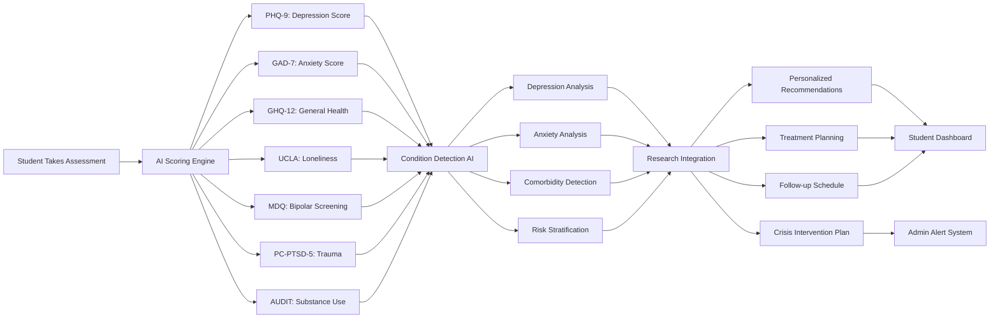
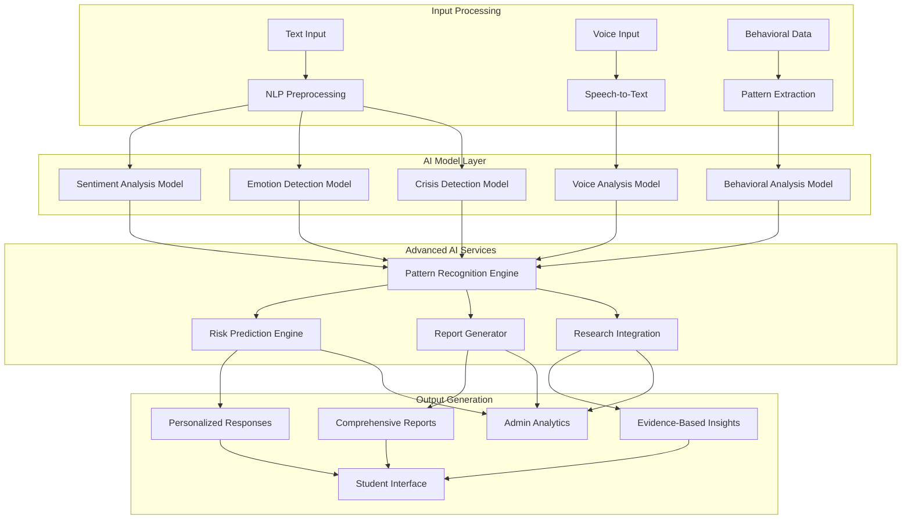
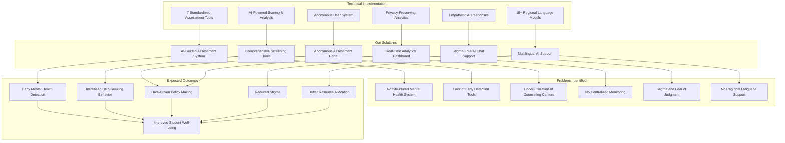
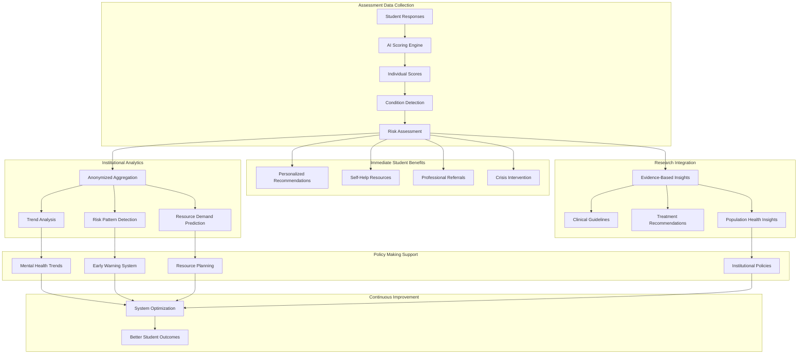
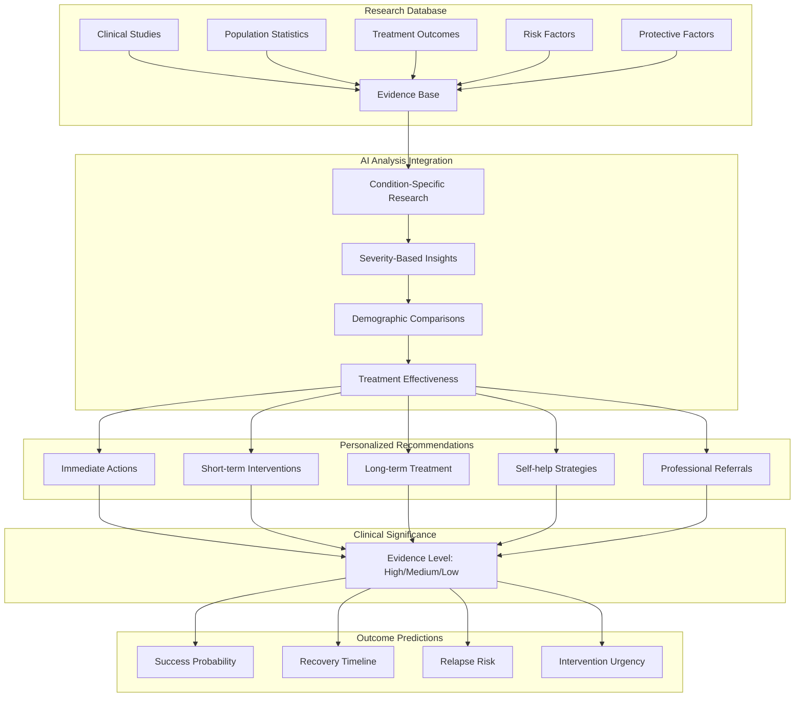
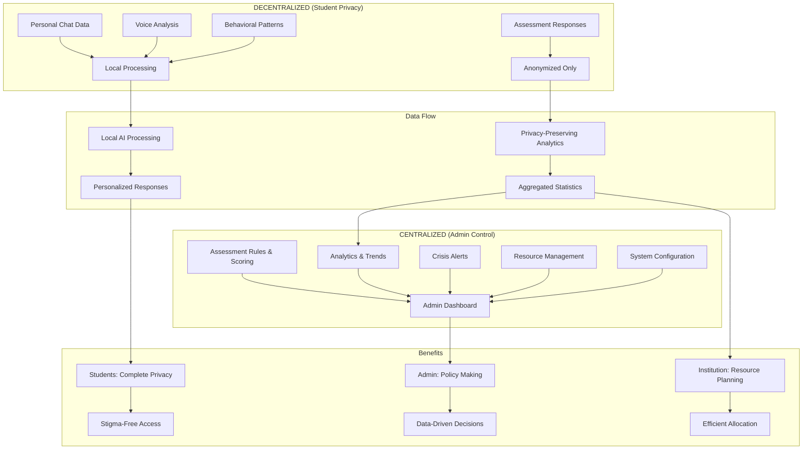
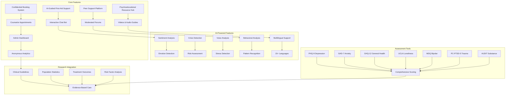

## 1. **Assessment Flow**

## 3. **AI Services Architecture**

## 4. **Problem Statement Solution Mapping**

## 5. **Assessment Results Utilization**

## 6. **AI Research Integration**

## 7. **Hybrid Model: Centralized vs Decentralized**

## 8. **Complete Feature Set**

